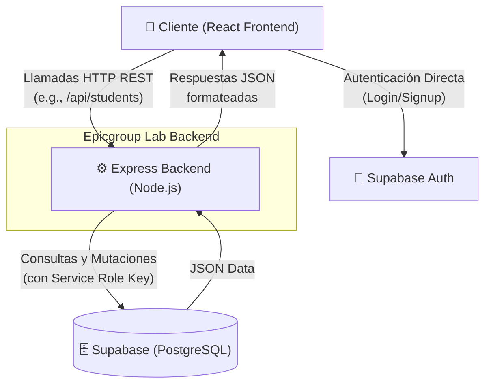

# 🚀 EPICGROUP LAB - Backend API

> [!NOTE]
> Este directorio contiene el código fuente de la API Backend del proyecto EPICGROUP LAB, encargada de servir los datos dinámicos, procesar las estadísticas de estudiantes y actuar como puente de seguridad hacia la base de datos de Supabase.

## 🛠️ Tecnologías Principales

- **Node.js & Express**: Framework base de la API y servidor web.
- **TypeScript**: Para garantizar la seguridad de tipos y reducir errores en tiempo de ejecución.
- **Supabase JS Client**: Para interactuar directamente con la base de datos PostgreSQL en la nube utilizando la *Service Role Key* (ignorando Row Level Security por tratarse de un entorno administrativo/de servidor controlado).
- **Multer**: Procesamiento seguro de cargas (archivos PDF de hasta 10MB).
- **dotenv**: Gestión de variables de entorno.

## 🏗️ Arquitectura y Flujo de Datos

El siguiente diagrama ilustra cómo el Backend interactúa con el cliente (Frontend) y con Supabase:



## ⚙️ Configuración e Instalación

### 1. Variables de Entorno
Crea un archivo `.env` en la raíz de esta carpeta `backend/` e incluye las siguientes variables indispensables:

```env
PORT=3001
SUPABASE_URL=https://<TU-PROYECTO>.supabase.co
# IMPORTANTE: Utilizar la Service Key para saltarse RLS en operaciones de API.
SUPABASE_SERVICE_KEY=eyJhbGciOiJI...
```

### 2. Comandos Disponibles

- `npm install`: Instala todas las dependencias usando `package-lock.json`.
- `npm run dev`: Inicia el servidor en modo desarrollo utilizando `nodemon` (recarga en caliente).
- `npm run build`: Compila el código fuente TypeScript (`src/`) a JavaScript (hacia `/dist`).
- `npm start`: Ejecuta la versión compilada de producción en el directorio `/dist`.

## 📡 Endpoints Principales (`src/index.ts`)

La API está modularizada de la siguiente manera:

1. **Gestión de Estudiantes y Progreso (`/api/students...`)**
   - Obtención masiva de progreso, jerarquía, calificaciones y envío/modificación/borrado de comentarios.
2. **Gestión de Profesores (`/api/professors...`)**
   - Consulta de cursos vinculados, resúmenes estadísticos de promedios de estudiantes y extracciones de tareas (assignments).
3. **Jerarquía Administrativa (`/api/admin...`)**
   - Endpoints para crear usuarios de diferentes tipos y gestionar la relación entre **Centros Educativos** y sus profesores.

> [!IMPORTANT]
> **Gestión de Sesión:** Si bien el Backend procesa la lógica de negocios y las relaciones abstractas (promedios, cursos, agrupamiento de comentarios), el inicio de sesión y la verificación de tokens de usuario principal las realiza el cliente (Frontend) interactuando directamente con Supabase Auth.

---

## 🔧 Scripts de Mantenimiento y Carga de Datos

Esta plataforma provee una serie de scripts auxiliares para poblar, sincronizar y depurar masivamente (Mass-Insertion) la base de datos. Se recomienda ejecutar estos scripts con cautela.

### Inserción Masiva por Archivos

Estos scripts utilizan el entorno Node aislado o la consola de depuración del navegador para cargar alumnos con correos reales institucionales usando la Auth API de Supabase `supabase.auth.signUp()`.

- **`insert-all-users-complete.js`** (Raíz del proyecto)
  Script automatizado de alto nivel para enviar todas las cuentas al sistema. Está adaptado para parsear correos electrónicos con dominios específicos y generar el registro iterativo. Agrega pausas sistemáticas para eludir límites de tarifa (*Rate Limits*).
  
- **`frontend/src/insert_users/console-script.js`**
  Un script diseñado para inyectarse directamente en la consola de Chrome/Firefox por el desarrollador. Intercepta la instancia de `window.supabase` ya autenticada en React para lanzar la creación de las diferentes *cohortes* (Ej. IPDC1, IPDC3, IPDC5) a demanda.

> [!CAUTION]
> Cuando se ejecuten operaciones de *Mass Insertion*, es indispensable contar con los Triggers de SQL (`public.sync_users_trigger()`) activos para asegurar que toda cuenta nueva en `auth.users` genere automáticamente su perfil visible en `public.users`. Así mismo, evita múltiples ejecuciones inmediatas seguidas para no sobrecargar los nodos con solicitudes de registro de cuentas.
