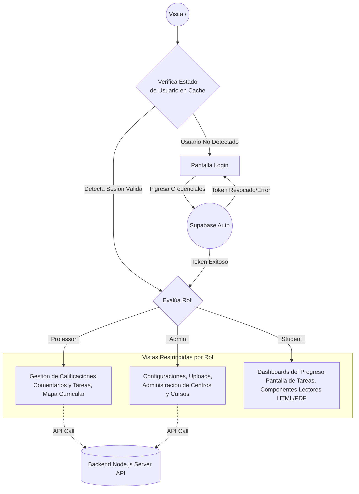

# 🎨 EPICGROUP LAB - Frontend SPA

> [!NOTE]
> Este directorio contiene el código fuente de la Aplicación de Página Única (Single Page Application - SPA) de EPICGROUP LAB. Está desarrollada con herramientas modernas para interfaces rápidas e intuitivas (UI/UX).

## 🛠️ Stack Tecnológico

- **React 18**: Librería declarativa central para la construcción visual de los componentes de la interfaz.
- **TypeScript**: Estructura estricta para mitigar vulnerabilidades y facilitar el desarrollo en equipo.
- **Vite**: Motor compilador y empacador super rápido que sirve el directorio a altas velocidades y reduce el peso final del paquete de despliegue.
- **React Router DOM v6**: Componente que controla el flujo de enrutamiento y la navegación sin recargas dentro de la página.
- **Supabase JS**: SDK principal utilizado en conjunto con autenticación e interacciones nativas con la interfaz.

## 🧭 Flujo de Enrutamiento y Autenticación

El siguiente diagrama muestra el flujo protector global (Guard Route Flow) gestionado en el ecosistema React cuando un profesor, desarrollador o alumno intenta entrar al contenido.



## ⚙️ Configuración e Instalación

### 1. Requisitos y Variables de Entorno
Crea tu archivo `.env` en la raíz de esta subcarpeta (`frontend/`). A diferencia de los entornos Node.js, las variables en Vite deben empezar por `VITE_`:

```env
# La dirección del servidor local intermedio del backend
VITE_API_URL=http://localhost:3001
# Tus credenciales de acceso directo de UI para Supabase
VITE_SUPABASE_URL=https://<TU-PROYECTO>.supabase.co
VITE_SUPABASE_ANON_KEY=eyJhbGciOiJI... # Importante: ¡Solo usar clave ANON pública, nunca SERVICE_KEY aquí!
```

### 2. Comandos Disponibles

- `npm install`: Recupera e instala las librerías indicadas en el `package.json`.
- `npm run dev`: Lanza tu proyecto en un entorno local y activa HMR (Hot Module Replacement) para actualizar el navegador instantáneamente con cambios.
- `npm run build`: Convierte tu proyecto React de desarrollo a paquetes empaquetados JS orientados al máximo rendimiento en la carpeta `/dist/`.

## 📁 Arquitectura de Carpetas Destacable (`src/`)

- **/components**: Todas las interfaces, recuadros y menús del sistema. Desde los perfiles y logins, hasta visores interactivos (`CoursePdfViewerScreen.tsx` o `GradesScreen.tsx`).
- **/lib**: Rutinas encargadas de lidiar con librerías externas.
  - `api.ts`: Librería empaquetada e integrada con TypeScript que consume toda la lógica de los servicios del servidor `/api/...` del Backend de Express.
  - `supabase.ts`: Inicializador persistente de la conexión y servicios de autenticación asíncrona hacia Supabase (como `signIn`, `signUp`, y reseteos de contraseñas).
- **/utils**: Funciones genéricas de utilería (como `getUserRole.ts` para determinar privilegios del JWT).
- **/insert_users**: (Visto también en la documentación del backend), scripts creados explícitamente para insertar contenido desde consolas virtuales evitando integraciones estandarizadas en pantallas públicas.

> [!TIP]
> Cualquier componente nuevo de pantalla que se introduzca en `/components/` debe ser incluido y mapeado directamente sobre el `Router` maestro albergado y protegido dinámicamente en el documento principal `App.tsx`. Todas las vistas son protegidas evaluando el prop `{user}` que es resuelto desde Supabase bajo el `useEffect` inicial global.
